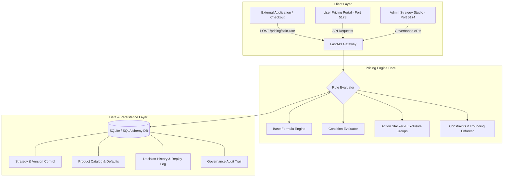

# ⚡ Monetize360 — Universal Dynamic Pricing Engine
> **One Configurable Pricing Brain for Every Industry — Configuration Instead of Redevelopment.**

[](https://www.python.org/)
[](https://fastapi.tiangolo.com/)
[](https://react.dev/)
[](https://vitejs.dev/)
[](LICENSE)

Monetize360 is a **zero-code, domain-agnostic dynamic pricing platform** built to calculate, explain, simulate, and govern price decisions across multiple industries (Hospitality, Car Rental, Financial Services, Cloud Compute, Tours, and Logistics) without modifying backend application code.

---

## 🚀 Key Features

### 1. ⚡ Bounded Dual-Portal Interfaces
- **User Dynamic Pricing Portal (`http://127.0.0.1:5173`)**: Clean, distraction-free interface for employees, apps, or customers to select products, enter situation context, and calculate prices with instant step-by-step explanations.
- **Admin Strategy Studio (`http://127.0.0.1:5174`)**: Governance studio for business admins to build domains, set typed attributes, compose base formulas, define pricing rules, test scenarios, run what-if simulations, and manage audit logs.

### 2. 🧠 Domain-Agnostic Engine (Zero Backend Code Changes)
Add new industry pricing strategies (e.g. Hotel Rooms, Loan Rates, Car Rentals, SaaS Compute) in **under 60 seconds** purely through configuration:
- Declarative AST Condition Evaluator (`ALL`/AND, `ANY`/OR, `NOT`, `eq`, `ne`, `gt`, `gte`, `lt`, `lte`, `in`, `between`).
- Priority-based rule execution with `exclusive_group` conflict resolution.
- Hard policy boundaries (`minimum`, `maximum`, `round_to`).

### 3. 🔍 3-Step Plain-English & Technical Explainability
Every price decision answers **"Why did the system arrive at this price?"**:
1. **Base List Amount**: Computed starting list price.
2. **Applied Adjustments**: Itemized breakdown of matched discounts (green) and markups (blue) with running subtotals.
3. **Min/Max Bounds & Rounding**: Policy limit enforcement check.
4. **AST Technical Trace**: Full rule evaluation log for audit and debugging.

### 4. 🧪 What-If Simulations & Counterfactual Analysis
- Disable specific rules to isolate their downstream price impact before publishing.
- Time-travel testing with datetime-local evaluation timestamps (`at`).
- Side-by-side Candidate vs. Baseline version comparison.

### 5. 📜 Immutable Governance & 1-Click Deterministic Replay
- Strict lifecycle workflow: `Draft` → `Validate` → `Approve` → `Publish`.
- Complete governance audit trail of all strategy updates and publication events.
- **1-Click Deterministic Replay**: Re-runs past transaction decisions against historical configuration hashes to verify 100% reproducibility.

### 6. 🤖 Optional Gemini AI Copilot
Translates natural-language pricing instructions (e.g., *"Give a 15% discount for annual commitments and add a 25% surge during peak season"*) into structured JSON draft strategies.

---

## 🏗️ Architecture & Topology



---

## 📊 Domain Abstraction Matrix

| Dimension | Hotel / Hospitality | Car Rental | Banking & Credit Rates | Cloud Compute |
| :--- | :--- | :--- | :--- | :--- |
| **Priced Unit** | `stay` / `night` | `day` | `annual_rate` (%) | `hour` / `seat` |
| **Key Attributes** | `nights`, `occupancy`, `member`, `arrival` | `rental_days`, `driver_age`, `insurance_tier` | `credit_score`, `loan_term_months`, `collateral_ratio` | `usage_hours`, `region`, `sla_tier`, `is_annual` |
| **Base Calculation** | `base_rate * nights` | `base_rate * rental_days` | `base_rate` (Base Interest Rate) | `base_rate * usage_hours` |
| **Rule Types** | Occupancy markup, Member discount, Peak season rate | Young driver surcharge, Long-term discount | Credit tier discount, High-risk penalty | Volume tier discount, SLA premium |
| **Constraints** | Minimum price per night, integer rounding | Minimum 1-day charge, round to nearest 10 | Min 5% rate, Max 30% APR, 2 decimal places | Min rate floor, round to 4 decimals |

---

## ⚙️ Quick Start Guide

### Prerequisites
- **Python 3.11+**
- **Node.js 22+**

### 1. Clone & Install Dependencies
```bash
git clone https://github.com/Sujith-roy12/Monetize360.git
cd Monetize360

# Install Python backend dependencies
pip install -r requirements.txt

# Install React frontend dependencies
cd frontend
npm install
cd ..
```

### 2. Start the Backend API (Terminal 1)
```bash
python -m uvicorn backend.app.main:app --reload --port 8000
```
> Backend API will run on **http://127.0.0.1:8000**  
> Swagger Documentation: **http://127.0.0.1:8000/docs**

### 3. Start the User Portal (Terminal 2)
```bash
cd frontend
npm run dev:user
```
> User Dynamic Pricing Portal will run on **http://127.0.0.1:5173**

### 4. Start the Admin Studio (Terminal 3)
```bash
cd frontend
npm run dev:admin
```
> Admin Strategy Studio will run on **http://127.0.0.1:5174**

---

## 📡 External Pricing API Specification

### Endpoint: `POST /pricing/calculate`

#### Request Payload
```json
{
  "product_id": "hospitality_standard",
  "context": {
    "nights": 3,
    "occupancy": 92,
    "member": true,
    "arrival": "2026-10-15"
  }
}
```

#### Response Payload
```json
{
  "final_price": 9720.0,
  "base_amount": 9000.0,
  "engine_latency_ms": 1.25,
  "engine_version": "2.0.0",
  "version": 1,
  "decision_id": 42,
  "product_id": "hospitality_standard",
  "product_name": "Hospitality — Standard",
  "trace": [
    {
      "id": "high_occupancy",
      "name": "High occupancy adjustment",
      "status": "applied",
      "delta": 1800.0,
      "after": 10800.0
    },
    {
      "id": "loyalty_discount",
      "name": "Loyalty member discount",
      "status": "applied",
      "delta": -1080.0,
      "after": 9720.0
    }
  ]
}
```

---

## ⏱️ 60-Second New Domain Onboarding Challenge

To demonstrate domain-agnostic capability during live hackathon presentations:

1. Open **Admin Studio** (`http://127.0.0.1:5174`).
2. Go to **Domain & Strategy Builder** → Click **`+ Clone as new domain`**.
3. Set Strategy ID `car_rental_live`, Name `Car Rental Live`, Unit `day`, Currency `INR`.
4. Under **Attributes**, add `rental_days` (integer), `driver_age` (integer), `insurance` (boolean).
5. Under **Rules**, add `Young Driver Surcharge` (+20% if `driver_age < 25`).
6. Click **Validate & test** → **Approve version** → **Publish version**.
7. Go to **Product Catalog** → Create product `suv_rental` linked to `car_rental_live` with Base rate `2500`.
8. Open **User Portal** (`http://127.0.0.1:5173`) → Select `suv_rental` → Click **Calculate Price**.

**Result**: A brand new industry domain is live and calculating prices in **under 60 seconds with zero backend code changes**.

---

## 📄 License

This project is licensed under the MIT License — see the [LICENSE](LICENSE) file for details.
