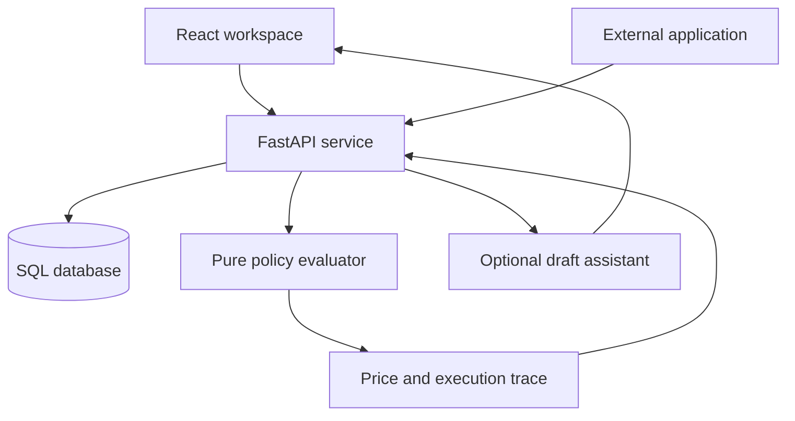
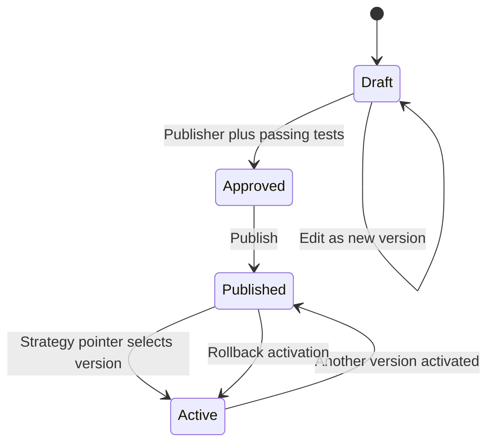

# Architecture and decisions

## Chosen approach

The core is a deterministic, configurable policy interpreter. Optional AI assists authoring, not runtime calculation. This matches the official brief's core requirements and its explicit separation of AI-assisted configuration from deterministic execution.

| Approach | Value | Tradeoff for this prototype |
|---|---|---|
| Hardcoded rules | Quick first demo | Fails new-domain challenge; rejected |
| Configurable rule interpreter | Transparent, repeatable, works without training data | Requires human-designed policy; selected core |
| ML price regression | Fits historical outputs | Historical prices are not necessarily optimal; no trustworthy dataset supplied |
| Demand model + constrained optimizer | Can optimize a measurable business objective | Needs price-sensitive demand observations, causal care, evaluation and cold-start handling; future extension |
| Hybrid ML + rules | Learned signal plus explicit guardrails | Best future direction when real data exists; not falsely claimed as implemented |
| Transfer/meta-learning | Potential reuse of learned patterns | Unproven cross-domain transfer, different targets/units; too speculative for this build |

Do not describe an availability fraction as ML. A reusable abstraction is typed attributes plus composable expressions, conditions and actions, not forcing every industry into five numeric features.

## Components and interactions

React never calculates the authoritative price. FastAPI resolves product → active version, snapshots inputs, injects the timestamp, and calls the same evaluator used by simulation and replay. The database stores decisions only after successful pricing. AI proposals go back for human review, not directly into active policy.

## User lifecycle

Status `published` means a version was published, not necessarily currently active. The `strategies.active_version` pointer chooses one version for new requests. Config documents are immutable through the API from creation; edits create another version. No scheduled publication or retire endpoint exists in this prototype. Effective timestamps belong to individual rules.

## Pricing path

1. Request identifies product and supplies context. Unknown product → 404.
2. Resolve product's strategy and active published version. Missing publication → 409.
3. Merge schema defaults, product defaults, then transaction context (highest precedence). Reject unknown fields, bad types, bounds violations or missing required attributes.
4. Evaluate the configured base expression with product `base_rate` and numeric attributes.
5. Sort rules by ascending `(priority, id)`. Evaluate enabled flags, effective intervals and nested conditions.
6. Apply actions. First matching rule in an exclusive group wins. All other matching rules stack.
7. Enforce configured minimum/maximum plus nonnegative output; map to a feasible rounding grid. Reject infeasible bounds.
8. Emit final Decimal-as-string result plus applied/skipped trace. Every adjustment reconciles to the final price.
9. Persist request, product snapshot, result, config hash, engine version and evaluation timestamp.

All industry differences live in configuration. There is no `if hotel`, `if banking`, or domain dispatch in the interpreter.

## Configuration language

- Attributes: number, integer, category, boolean, date; min/max, defaults, required flags and category options.
- Expressions: constant, field, add, subtract, multiply, divide, min, max. Structured trees, never Python/JavaScript `eval`.
- Conditions: AND (`all`), OR (`any`), NOT, equality/inequality, comparisons, membership, inclusive between.
- Actions: add, percent, multiply, set, basis_points (rate output only).
- Percent actions explicitly choose original base or current subtotal. -10 means a 10% reduction, not a multiplier of -10.
- A +25 basis-point action adds 0.25 to a rate represented as 9.5 for 9.5%.
- Effective rule intervals: start inclusive, end exclusive; timezone-aware timestamps required.
- Bounds may depend on input attributes and base amount, not mutable subtotal.
- Exclusive group priority ties are rejected; independent same-priority rules use ID order.
- Configured scenarios provide independently specified expected prices or expected rejections.

Default Decimal precision is explicitly set to 28 and numeric magnitude is bounded. Returned amounts are strings so JSON clients need not lose precision. Currency codes identify presentation only; there is no FX conversion.

## Reliability and failure behavior

Invalid context → 422, invalid expression/configuration → 422, conflicting state → 409, missing records → 404, bad write token → 403. No silent fallback price is fabricated. Optional AI outages → 502/503 and do not modify strategy state.

Publication reruns the version's scenario tests and checks compatibility of existing product defaults. This is not exhaustive input-space validation. A new required attribute may still require caller changes; integrators must assess their payload contracts before publishing.

`Idempotency-Key` on calculate deduplicates identical requests; reuse with a different payload returns 409. The demo key namespace is global, not per tenant. Replay checks the engine version and configuration hash; it refuses incompatible historical engines instead of pretending equality.

## Tables

| Table | Purpose |
|---|---|
| strategies | Identity/name and active version pointer |
| strategy_versions | Immutable config, SHA-256 hash, status, validation report |
| products | Strategy assignment, base rate, product defaults |
| decisions | Request and product snapshots, result/trace, version, idempotency |
| simulations | Scenario requests and results, separate from transactions |
| audit_events | Actor role, lifecycle action, entity, details, timestamp |

SQLAlchemy uses JSON on SQLite and JSONB on PostgreSQL. Tables are created at startup for the prototype; schema migrations are not implemented.

## API map

| Method/path | Purpose | Access |
|---|---|---|
| GET /health | DB health and AI configured flag | Public demo |
| GET /domains, /strategies | Strategy list | Public demo |
| POST /domains, /strategies | Create configuration | Editor/publisher |
| GET /strategies/{id}/versions | Immutable version history | Public demo |
| POST /strategies/{id}/versions | Save new draft | Editor/publisher |
| POST /strategies/validate | Structural + scenario validation | Public demo |
| POST /strategies/{id}/approve | Approve passing draft | Publisher |
| POST /strategies/{id}/publish | Publish/reactivate | Publisher |
| GET /products | Product list plus active schemas | Public demo |
| POST /products, PUT /products/{id} | Catalog changes | Editor/publisher |
| POST /pricing/calculate | Active-policy transaction | Public demo |
| POST /pricing/simulate | Explicit-version scenarios | Public demo |
| POST /pricing/compare | Baseline/candidate/counterfactual | Public demo |
| GET /pricing/history | Paginated decisions | Public demo |
| POST /pricing/history/{id}/replay | Historical verification | Public demo |
| GET /analytics, /audit | Observed usage and audit | Public demo |
| GET /auth/me | Check token role | Editor/publisher |
| POST /assistant/draft | External AI proposal, never save | Editor/publisher |

OpenAPI at `/docs` is generated from actual request schemas. Read/history/pricing endpoints are intentionally open for a localhost hackathon; they must be protected before multi-user deployment.
